# stamp

stamp reviews a pull request and approves it when your policy allows.

It runs deterministic gates and a scoped LLM review, then posts a real GitHub approval or a comment review that says why it held back. You still merge. stamp decides which PRs a person must read and which ones are safe to approve from the evidence.

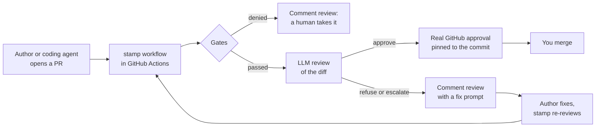

## Why you want it

Coding agents open more PRs than your team can read line by line. Most of those PRs are small, tested and low risk. A few touch auth, billing, migrations or CI, and those need a person.

stamp sorts them for you:

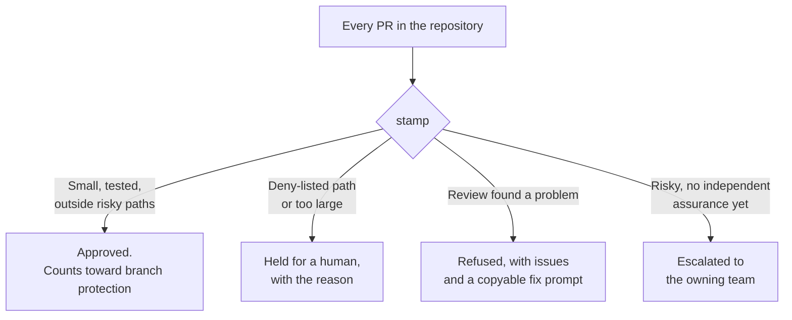

- You spend review time on the PRs that need judgment.
- Your approval rules keep working: stamp's approval is a GitHub review, so branch protection counts it.
- A PR cannot change the rules that gate it. stamp reads policy from the default branch.
- Each run leaves an evidence bundle you can audit.

On top of the gates and the review, stamp reports how well the author knows the changed code (git blame), honours per-folder size grants (`AGENT_APPROVALS.md` on the default branch), keeps an approval across pushes that leave the diff byte-identical, and can post a daily Slack digest.

You opt repositories in one at a time. stamp touches nothing else.

## How it works

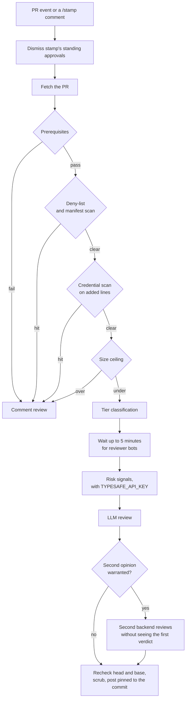

The gates decide first. The LLM can tighten a gate's result and can never loosen it.

### Prerequisites

- The PR is out of draft and has no merge conflicts.
- No "changes requested" review stands. A later comment does not clear one.
- The author is OWNER, MEMBER or COLLABORATOR, and the head lives on this repository, not a fork.
- The author is not a bot.

### The review

The reviewer reads files and searches the checkout, and does nothing else. It receives the diff, description, reviews, inline and discussion comments and reactions inside an untrusted-content fence. stamp leaves its own prior reviews out. The reviewer reads test hunks first and reports showstoppers only.

When HEAD is another commit, or the tree is dirty, stamp reviews from a detached worktree at the PR head.

## What a PR author sees

A repository either reviews every PR or waits for its trigger label. The engine returns one of four verdicts, and `--post` puts it on the PR.

| Verdict  | Where it lands                              | Trigger label in label mode |
| -------- | ------------------------------------------- | --------------------------- |
| APPROVED | A real GitHub review by the stamp login     | Kept                        |
| REFUSED  | A GitHub comment review by the stamp login  | Removed                     |
| ESCALATE | A GitHub comment review by the stamp login  | Removed                     |
| ERROR    | A GitHub comment review by the stamp login  | Kept, retries               |
| Gated    | A GitHub comment review by the stamp login  | Removed                     |

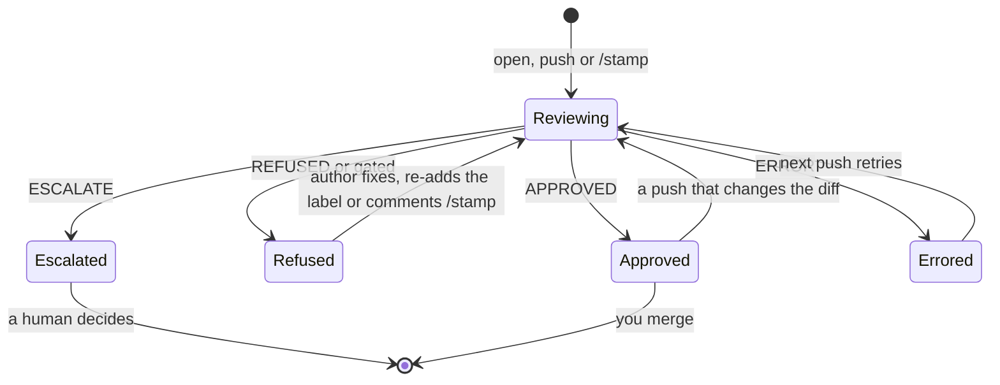

"Gated" means a deterministic gate, such as the deny-list or the size ceiling, denied the PR before any review. The engine reports it as `REFUSED` and removes the trigger label, because a person has to take it from there.

stamp posts an approval as a real review, once, pinned to the reviewed commit, carrying the review body, so it counts toward branch protection. It posts every other verdict once per run as a comment review on the same surface. The bot never requests changes.

The trigger label exists only in label mode, and only a substantive non-approval removes it. The author re-applies the label once they address the feedback. A verdict that says nothing about the PR keeps the label, and the next push retries.

`ERROR` means the run failed before it could judge the PR: the model backend was unreachable, or the reviewer returned something other than a verdict.

Each non-approval carries a collapsed **Fix with a coding agent** block. It holds the verdict, the issues and the requested next step as one prompt you can copy, with the rule that weakening a test or a lint rule to clear the review counts as a refusal. Agents write most of the PRs stamp sees, so the fix loop starts there.

Comment `/stamp` on a PR to re-run the review without an empty commit. stamp acts on comments from OWNER, MEMBER and COLLABORATOR only.

In CI the stamp login is `github-actions[bot]`. A local `--post` uses the account `gh` is logged in as. Each run can write an evidence bundle (`--json`), and the workflow uploads it as an artifact.

## Connect a repository

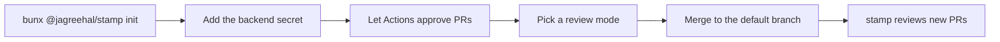

1. From the repository you want reviewed, run `bunx @jagreehal/stamp init`. It writes `.stamp/policy.yml`, `.stamp/review-guidance.md`, `.github/workflows/stamp.yml`, `.github/workflows/stamp-edited.yml` and `.github/workflows/stamp-digest.yml`. It never overwrites a file that exists.
2. Add the secret for your backend: your model provider's key (see [Backends](#backends)) with `STAMP_MODEL` as a repository variable, or `CLAUDE_CODE_OAUTH_TOKEN` (from `claude setup-token`) with `STAMP_BACKEND` set to `claude`.
3. In Settings → Actions → General, turn on **Allow GitHub Actions to create and approve pull requests**. Without it stamp still posts the approval, but the approval does not satisfy a required-reviews rule.
4. Pick a **review mode**. Leave `STAMP_LABEL` unset to review every PR. Set `STAMP_LABEL: stamp` in the workflow env to review only PRs with that label.
5. Merge. stamp reads policy from the default branch, so it applies once it lands.

The workflow runs on open, push, reopen, ready-for-review, label and unlabel. `stamp-edited.yml` calls it on a base retarget, or when the author edits the review agent's disclosure section into the body, so other description edits add no `stamp / review` run.

The workflow pins the engine version. The engine decides what gets approved, so a version bump should arrive as its own PR.

Start with one repository, all-PRs mode, and a spend cap on the key.

## Customize the review for your repository

Customization is optional. A repository with no `.stamp/` directory reviews under the bundled defaults in [`.stamp/`](.stamp/).

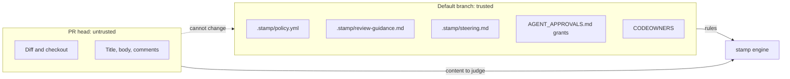

stamp reads the `.stamp/` files from the repository's **default branch**, never from the PR head, so a PR cannot rewrite the policy that gates it. When the default branch has no such file, stamp uses the bundled default, however many `.stamp/` files the PR adds.

| File                 | Required | Default when absent      | How it combines with the default                 |
| -------------------- | -------- | ------------------------ | ------------------------------------------------ |
| `policy.yml`         | No       | The bundled policy       | Replaces the bundled policy                      |
| `review-guidance.md` | No       | The bundled norms        | Replaces the bundled prose                       |
| `steering.md`        | No       | Nothing added            | Appended under "Repository-specific steering"    |

Folder `AGENT_APPROVALS.md` files, in any directory, raise size ceilings within `overrides:`. They live outside `.stamp/`, and stamp still deny-lists them and reads them from the default branch only.

The deny-list covers every edit to these files (`stamp_policy`), so the gate cannot approve changes to itself. The same category covers `CODEOWNERS`, a gate input, and `stamp/src/` for a repository that vendors the engine.

### Tiers

| Tier             | Lines | Files | Meaning                                    |
| ---------------- | ----- | ----- | ------------------------------------------ |
| T0-deterministic | –     | –     | Docs, tests, config only. Lighter bar.     |
| T1a-trivial      | ≤20   | ≤3    |                                            |
| T1b-small        | ≤100  | ≤5    |                                            |
| T1c-medium       | ≤300  | ≤15   |                                            |
| T1d-complex      | more  | more  | Full read, still under the ceiling.        |
| T2-never         | –     | –     | Deny-listed. A human, always.              |

Size sets how hard the reviewer looks. It never sets risk on its own. stamp can approve a large, well-tested refactor outside risky territory, and it refuses a five-line billing change.

### T2: never AI-approved

These categories carry a high blast radius even in a small diff:

| Category           | Patterns                                                                                    |
| ------------------ | ------------------------------------------------------------------------------------------- |
| **auth**           | auth, login, signup, oauth, saml, sso, oidc, credential, password, 2fa, mfa, permission, …   |
| **crypto_secrets** | crypto, encrypt, decrypt, vault, secret, api_key, private_key, certificate, `.env`, `.pem`   |
| **migrations**     | `migrations/`, `drizzle/`, `prisma/migrations`, schema_change                               |
| **infra_cicd**     | terraform, kubernetes, helm, k8s, dockerfile, `.github/workflows`, iam, cloudflare, `deploy.sh`, `vercel.json`, `fly.toml` |
| **billing**        | billing, payment, stripe, invoice, pricing                                                  |
| **public_api**     | openapi, api_schema, swagger, public_api                                                    |
| **deps_toolchain** | lockfiles, `requirements*.txt`, Makefile, `.nvmrc`, `.tool-versions`                        |
| **stamp_policy**   | `.stamp/`, `stamp/src/`, CODEOWNERS                                                         |

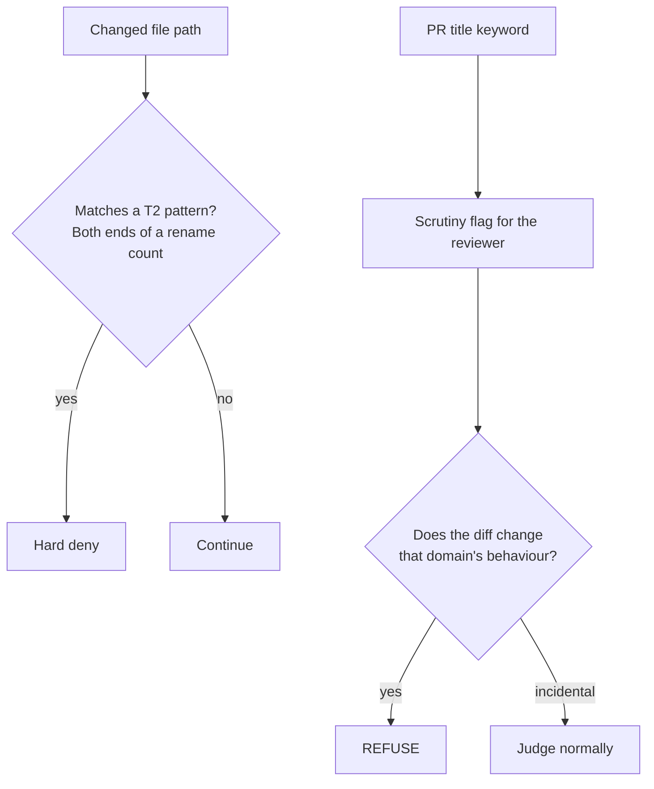

Only file paths hard-deny. A rename counts on both paths, so moving a file out of `auth/` changes `auth/`.

PR-title keywords never deny on their own. They reach the reviewer as scrutiny flags to verify against the diff: REFUSE when the change touches the flagged domain's behaviour, judge normally when the mention is incidental. A calibration against ~440 deny-listed PRs set that split: humans approved most title-only hits unchanged.

Word patterns match on boundaries that also break on `_` and `-`, so `secret` matches `secret_key.ts` and skips `nosecrets.ts`, and `auth` skips `author.ts`. A pattern containing `/` or starting with a dot matches as a path fragment.

Dependency _manifests_ (`package.json`, `pyproject.toml`, `Cargo.toml`, `go.mod`, `tsconfig*.json`) don't hard-deny either. Without a lockfile change they can't pull in third-party code, because CI installs from a frozen lockfile.

Two guards cover manifest scripts or hooks that execute in CI:

- A deterministic scan compares `scripts`, `husky`, `lint-staged`, `pnpm` and `simple-git-hooks` between base and head as parsed JSON. Editing an existing script's command never mentions `scripts` on the changed line, so a line diff would miss it. Any difference hard-denies, and so does a manifest that fails to parse.
- The reviewer prompt tells the model to REFUSE execution-bearing changes the scan can't name.

stamp keeps manifest PRs out of the T0 fast path.

### Scrutiny paths

`scrutiny:` in `policy.yml` names files that never deny on their own. stamp reports them to the reviewer with what would make the change a refusal.

The shipped `quality_gates` group covers lint, type-check, test and coverage configuration: `.oxlintrc`, `eslint.config`, `biome.json`, `vitest.config`, `codecov`, `.pre-commit-config`, `.husky/`, scanner settings such as `.semgrepignore`, `.gitleaks.toml` and `.golangci`, and the rest of that list. The reviewer must REFUSE a disabled or downgraded rule, a widened ignore, a lowered coverage threshold, a strict flag turned off, a `skip` or `only` on a test, a removed hook, or an excluded scanner rule or path. It approves tightening.

Agents loosen these files to reach green, and a linter cannot see its own config change. A path deny would refuse a tightened rule along with a loosened one, so the reviewer judges the diff.

stamp also scans added lines for suppression comments: `eslint-disable`, `oxlint-disable`, `biome-ignore`, `@ts-ignore`, `@ts-expect-error`, `noqa`, `nosec`, `nosemgrep`, `nolint`, `type: ignore`, coverage ignores and their kin. Each one reaches the reviewer as a `suppressions` scrutiny flag naming the file and the kind. The reviewer reads the code each one covers, refuses a suppression that hides a finding the change introduces, and approves a narrow one with its reason. Like any scrutiny flag, it also brings in the second reviewer when one is configured.

The shipped `review_agents` group covers what review and fix agents follow on later PRs: `.shepherd/`, `.claude/skills/`, `.agents/skills/`, `AGENTS.md`, `CLAUDE.md` and `docs/adr/`. The reviewer must REFUSE a removed lens, a narrowed `applies_to`, a deleted or weakened rule, loosened Fix guidance or a relaxed house rule. It approves additions and tightening.

### Size ceiling

Over 800 substantive lines or 30 substantive files, a PR is too large for auto-review.

Docs, snapshots, images, lockfiles and tests don't count toward the ceiling: they inflate diffs without adding review surface. They still count toward tier classification, and the reviewer still reads them.

90 days of denial outcomes set the limits. Denied PRs that merged unchanged cluster at 500–750 substantive lines, and past ~800 the merged-unchanged rate collapses, so stamp escalates there.

Per-folder grants raise those limits within the `overrides:` ceilings in `policy.yml` (defaults 1000 lines / 50 files). Put an `AGENT_APPROVALS.md` on an ancestor of the changed files:

```yaml
---
stamp:
  size_gate:
    max_files: 40
    max_lines: 900
---
```

stamp reads grants from the **default branch** only, the same trust boundary as policy. It ignores a file with invalid frontmatter. The nearest valid grant wins per key, and a roof (the most generous ceiling in play) still bounds the whole PR. The deny-list covers edits to `AGENT_APPROVALS.md`.

### Author familiarity

When policy sets `familiarity:` (the bundled policy does), stamp measures how well the author knows the changed code from git blame and their merged PRs in those paths. It reads default-branch history only. STRONG and MODERATE bands reach the reviewer as trusted facts and never touch a gate. A missing signal or band NONE leaves the review as strict as before.

### Approval retention

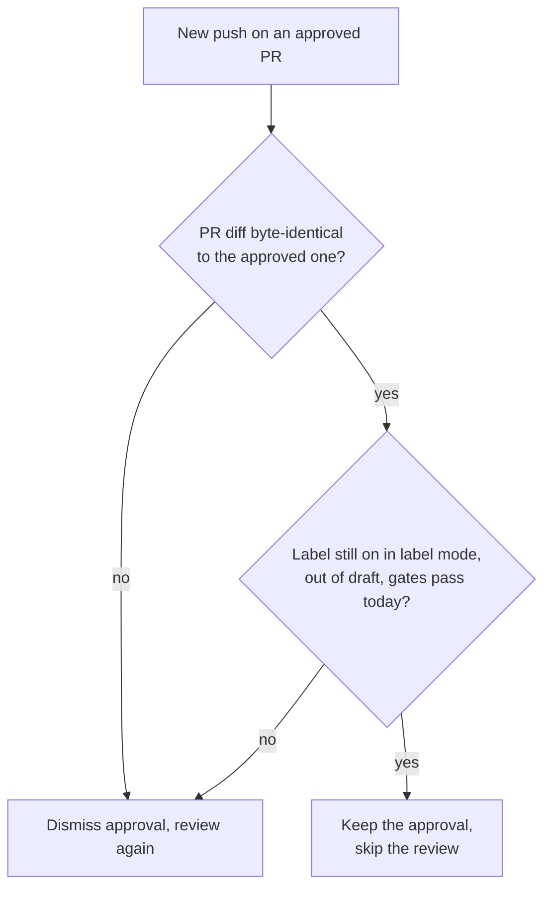

A push that leaves the PR's unified diff byte-identical to the approved one, usually a base-branch merge, keeps the standing approval and skips re-review. stamp keeps it only while the trigger label stays on, the PR stays out of draft, every gate passes against today's policy, and the PR still matches what stamp checked. Empty diffs, binaries or compare errors send the PR down the normal dismiss-and-review path. A `/stamp` comment starts a fresh review.

### Slack digest

`stamp init` also writes `.github/workflows/stamp-digest.yml`. It stays off until you set the `STAMP_SLACK_WEBHOOK` secret. Then a weekday cron posts stamp-approved merges to that webhook's channel: the last 24 hours, or 72 on Monday to cover the weekend. stamp escapes PR titles and summaries so they cannot mention or link in Slack.

## Backends

`STAMP_BACKEND` decides who runs the model. The prompt, the gates and the verdict schema stay the same.

| `STAMP_BACKEND` | Runs the review through | Auth | Model |
| --------------- | ----------------------- | ---- | ----- |
| `api` (default) | The AI SDK, on any provider below | That provider's key | `STAMP_MODEL`, default `claude-opus-5` |
| `claude`        | Claude Code, headless (`claude -p`) | `CLAUDE_CODE_OAUTH_TOKEN` from `claude setup-token`, in an isolated container | `STAMP_CLAUDE_MODEL`, default Claude Code's |
| `codex`         | Codex, headless (`codex exec`) | `CODEX_API_KEY` or `OPENAI_API_KEY`, in an isolated container | `STAMP_CODEX_MODEL`, default Codex's |

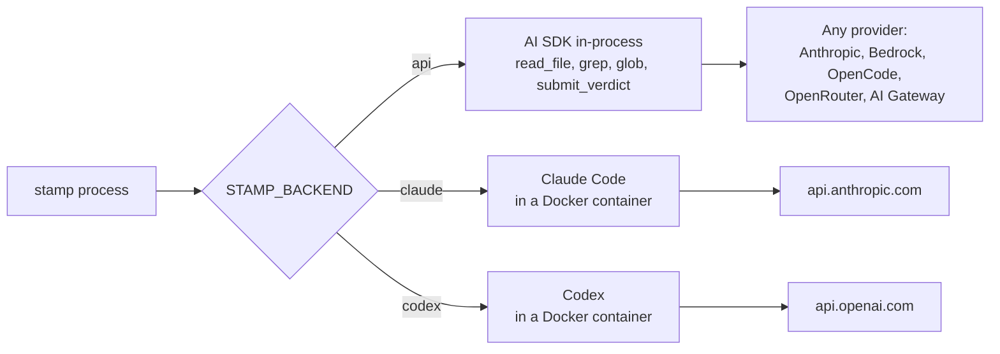

`STAMP_MODEL` is `provider:model`, or a bare Claude id for Anthropic. The `api` backend gives the model three tools confined to the checkout, `read_file`, `grep` and `glob`, and the model ends by calling `submit_verdict`.

| `STAMP_MODEL` | Provider | Key |
| ------------- | -------- | --- |
| `claude-opus-5` (no prefix) | Anthropic, or any endpoint in `ANTHROPIC_BASE_URL` | `ANTHROPIC_API_KEY` |
| `bedrock:zai.glm-4.7-flash`, `bedrock:us.anthropic.claude-sonnet-5-5` | Amazon Bedrock (Claude through InvokeModel, the rest through Converse) | `AWS_BEARER_TOKEN_BEDROCK` or OIDC credentials, and `AWS_REGION` |
| `opencode-go:kimi-k3`, `opencode:claude-sonnet-5-5` | OpenCode Go and Zen | `OPENCODE_API_KEY` |
| `openrouter:moonshotai/kimi-k3` | OpenRouter | `OPENROUTER_API_KEY` |
| `gateway:anthropic/claude-sonnet-5.5` | Vercel AI Gateway | `AI_GATEWAY_API_KEY` |

```bash
STAMP_MODEL=claude-opus-5                       ANTHROPIC_API_KEY=sk-ant-...
STAMP_MODEL=bedrock:zai.glm-4.7-flash           AWS_BEARER_TOKEN_BEDROCK=...  AWS_REGION=eu-west-1
STAMP_MODEL=opencode-go:deepseek-v4-flash       OPENCODE_API_KEY=...
STAMP_MODEL=openrouter:moonshotai/kimi-k3       OPENROUTER_API_KEY=...
STAMP_BACKEND=claude                            # CLAUDE_CODE_OAUTH_TOKEN required
STAMP_BACKEND=codex                             # CODEX_API_KEY or OPENAI_API_KEY required
```

### Isolated CLI reviewers

`claude` and `codex` run in Docker containers. Docker must be running. stamp builds a trusted reviewer image from the packaged `templates/reviewer.Dockerfile`, never from the PR checkout.

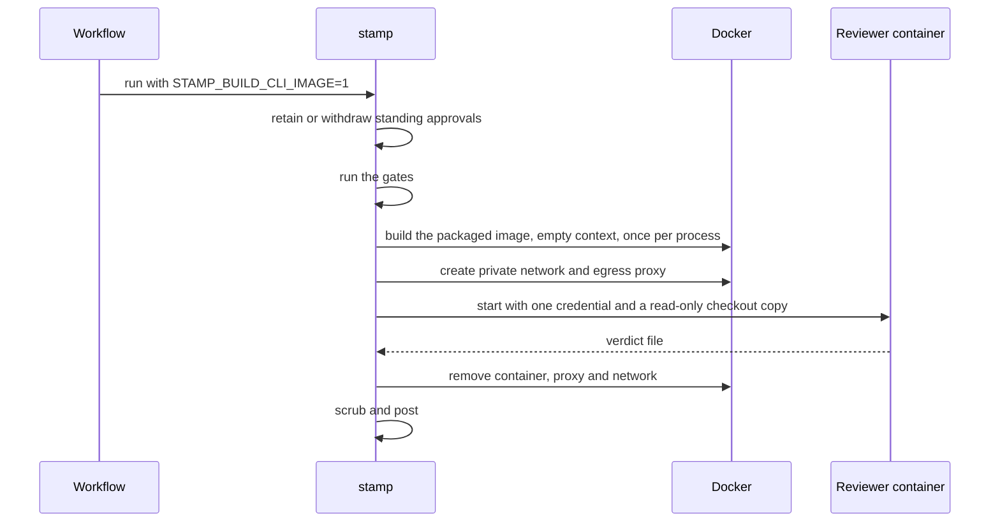

The generated workflow sets `STAMP_BUILD_CLI_IMAGE=1`. stamp handles approval retention or withdrawal, runs the gates, then builds the packaged image with an empty build context before it calls a CLI reviewer. Add the image setting and `CODEX_API_KEY` or `OPENAI_API_KEY` to existing workflows.

For local use, set `STAMP_BUILD_CLI_IMAGE=1`, or build from a trusted stamp checkout with an empty context:

```bash
review_context="$(mktemp -d)"
docker build -f templates/reviewer.Dockerfile -t stamp-reviewer:local "$review_context"
```

`STAMP_CLI_IMAGE` selects another trusted image; prefer a digest for a published image. A missing Docker daemon, image or backend credential ends the review as ERROR, with no fallback to a host CLI. stamp never mounts host login files. Claude uses `CLAUDE_CODE_OAUTH_TOKEN` (from `claude setup-token`). Codex uses `CODEX_API_KEY` or `OPENAI_API_KEY`, which stamp passes to `codex exec` as `CODEX_API_KEY`.

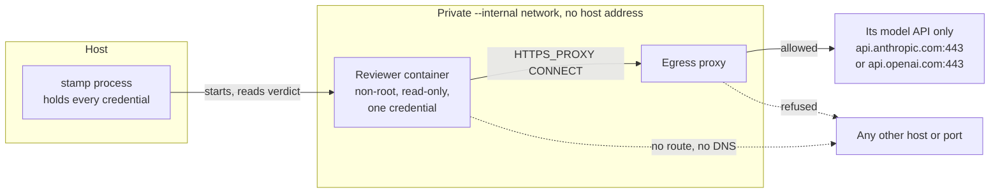

The container has its own process namespace, so `/proc` cannot expose stamp's environment. It receives its own backend credential, a read-only checkout copy without `.git`, trusted review instructions and an empty output directory, and nothing more. It runs as a non-root user with capabilities dropped and privilege escalation disabled. stamp never mounts host homes, Docker sockets or credential directories, and treats container output as untrusted, verdict-file symlinks included.

Each review gets a private Docker network with no route out, on which the host has no address. An egress proxy, started from the same image, is its one door: it tunnels `CONNECT` to the reviewer's model API, only when the TLS ClientHello inside the tunnel names that same host, and refuses everything else. The name check stops a tunnel to the provider's address from reaching another site on the same CDN. Claude reaches `api.anthropic.com:443`, Codex reaches `api.openai.com:443`. The reviewer reaches the proxy through `HTTPS_PROXY`; a request that skips it has no route and no DNS. The proxy logs each decision.

Codex runs `danger-full-access` because nested Linux sandboxing needs privileges this container does not grant. The container is the boundary: a read-only checkout and filesystem, writable storage limited to temporary state and the verdict, and a network path to its own provider only. A command Codex runs can reach that provider and nothing else. The provider's API can fetch a URL it receives, such as an image input, so a hijacked review could route data out through the provider, and the proxy sees encrypted traffic it cannot inspect. Use a dedicated key with a spend limit, and choose the `api` backend, which has no shell, where that matters.

stamp redacts configured credential values from posted reviews, console verdicts and evidence bundles, including CLI login tokens, provider keys and telemetry headers.

The `api` backend runs its repository-confined tools in-process and needs no Docker.

### Limits, cost and traces

Every `api` review runs under `STAMP_GUARD`, written in autotel's rule shorthand. The default is `budget:$2,tokens:3m,loop:4/12,max-tools:80,timeout:15m`: a cost ceiling, a token ceiling, a spin-loop rule (the same call 4 times in 12), a tool-call cap, and a timeout that also cuts off a model call in flight. A rule that fires ends the review as ERROR. A model without a price keeps its token ceiling; give it a price with `STAMP_PRICING='{"kimi-k3":{"inputPer1M":3,"outputPer1M":15}}'`.

The mechanics table names the model, its tool calls, the cost and the time (`bedrock:zai.glm-4.7-flash · 9 tool calls · $0.0042 · 6.2s`). The `--json` evidence carries the full run record: steps, tool calls and failures, tokens, cost and the limits it ran under. Set `OTEL_EXPORTER_OTLP_ENDPOINT` and each review also becomes a trace of `gen_ai.*` spans, one per model call and tool call.

The agent backends load nothing the PR ships as configuration. [AGENTS.md](AGENTS.md) records how stamp isolates each one and what was tested.

On a comment-only diff, Claude Code grepped the source before approving. Codex on its default model approved from the diff alone. Set `STAMP_CODEX_MODEL` to a model that explores.

### Two reviewers

```bash
STAMP_BACKENDS=claude,codex
STAMP_BACKENDS=bedrock:zai.glm-4.7-flash,openrouter:moonshotai/kimi-k3   # two api models from different families
```

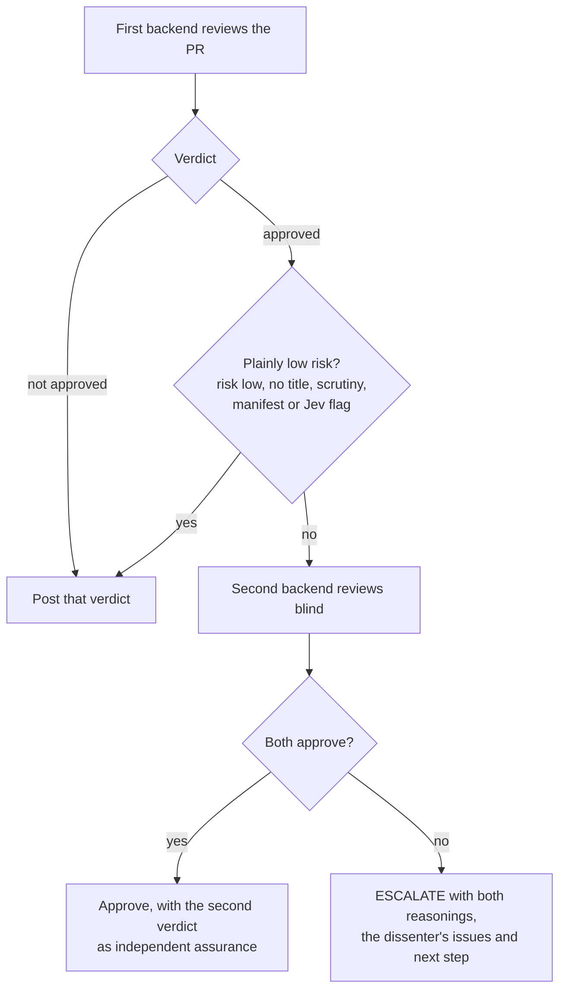

The first backend reviews every PR. The second runs when the first approves something above plain low risk: a risk above `low`, or a title, scrutiny, manifest or Jev flag. It never sees the first verdict.

When both approve, stamp approves and lists the second verdict in the mechanics table as the independent assurance risky territory asks for. When they disagree, stamp posts ESCALATE with both reasonings, the dissenter's issues and its next step. A plainly low-risk PR costs one call.

Across 146 real PRs, four commercial reviewers never flagged the same line, and 93% of findings came from one tool alone. Two models from different families miss different things.

### Risk signals

```bash
TYPESAFE_API_KEY=...
```

With a key, stamp asks [Jev](https://docs.typesafe.ai/concepts/system-one) ten yes/no questions about the diff before the reviewer runs. Does the change alter auth, billing, the data model or a public contract, CI or build tooling, dependencies or install scripts, a data write path? Does it feed user input into a prompt, weaken tests or CI config, or do something the description leaves out?

Jev answers each question with a calibrated probability and no prose, in a few hundred milliseconds, for a fraction of a cent. The probabilities go into the reviewer's trusted context, count as flags at 0.7 and above for the second-opinion trigger, and land in the evidence bundle. They never act as a gate and cannot loosen one. stamp tells the reviewer to treat a flag as a magnifying glass and a low probability as no assurance.

Path patterns cannot see behaviour. A PR titled "nicer export filenames" that also inserts an admin grant in `src/export.ts` matches no deny pattern; Jev gave it `undisclosed_behavior` 0.97, `auth` 0.95, `write_path` 0.88. A test-weakening diff scored `weakens_tests` 0.98; a comment-only diff scored 0.03 across the board.

Those are three calls, not a calibration. Tune the threshold against your evidence bundles and what you merged.

## A team

With a `CODEOWNERS` on the default branch (`.github/`, root or `docs/`), stamp tells the reviewer who owns each changed file and whether the author is a listed owner. That stays advisory and never gates.

An author who owns what they touched counts as assurance in risky territory; a cross-team author does not, and an ESCALATE names the owning team in its next step. stamp cannot resolve team handles (`@org/team`) to members without an org read the Actions token lacks, so it reports membership as unknown and a teammate's review becomes the assurance path.

In risky territory stamp will not approve on its own reading. It needs an APPROVED or substantive COMMENTED review from a person or a different AI reviewer on the current head.

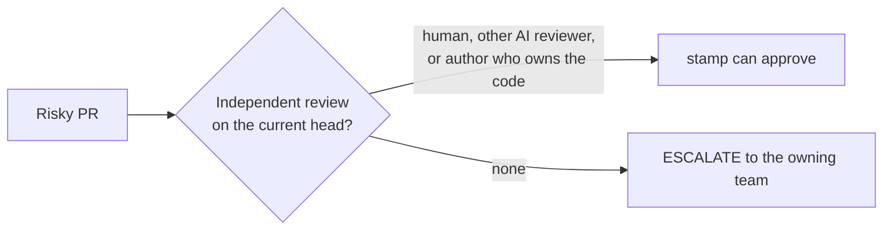

List your other reviewer bots under `reviewer_bots` in `policy.yml` so stamp waits for their 👀 before it approves. A 👀 younger than 45 minutes holds the review for up to five minutes; their comments join the prompt when they post. Nothing re-triggers the workflow when a bot finishes, so a run that waited forever would never post a verdict. stamp ignores an older 👀 as a crashed reviewer.

The `github-actions[bot]` approval counts toward required approving reviews once the Actions setting above is on. It does not satisfy "require review from Code Owners", and it should not: that rule exists so a person on the owning team looks, and stamp escalates to that person.

Copy `.agents/skills/` (`writing-pr-descriptions`, `merging-prs`, `pr`) into repositories where agents open PRs. `pr` is [Matt Pocock's skill](https://github.com/mattpocock/skills), copied unchanged; `writing-pr-descriptions` uses its Merge Danger section and visuals.

When a PR closes issues in its own repository, stamp passes their title and body to the reviewer inside the untrusted fence. It skips issues in other repositories, which can be private while the PR is public. The reviewer checks the diff does what they ask: a change that does the opposite of its issue is a showstopper, and a vague issue never refuses a PR on its own.

### Review automation

stamp reads review threads with their resolution and includes unresolved threads in the review context. It reads an agent's "Changes made during review" disclosure as a separate section, and reviews the current head after the author updates that disclosure.

stamp includes review-agent commit trailers as context. The reviewer checks the diff against the stated intent and the test evidence in the PR body.

## Local review

```bash
# run from inside the repository you want reviewed
bunx @jagreehal/stamp 42

# dry run (gates only, no LLM calls)
bunx @jagreehal/stamp 42 --dry-run

# post the verdict to GitHub
bunx @jagreehal/stamp 42 --post

# save the full result as JSON, show tool calls
bunx @jagreehal/stamp 42 --json /tmp/review.json -v

# post the Slack digest of stamp-approved merges from the last 48 hours
STAMP_SLACK_WEBHOOK=https://hooks.slack.com/... bunx @jagreehal/stamp digest --since 48
```

You need [bun](https://bun.sh) and an authenticated `gh` CLI.

The exit code is 0 on APPROVED and 1 on every other verdict. `--dry-run` turns `--post` off.

## Security model

stamp runs an LLM over untrusted PR content, so it trusts nothing the PR ships.

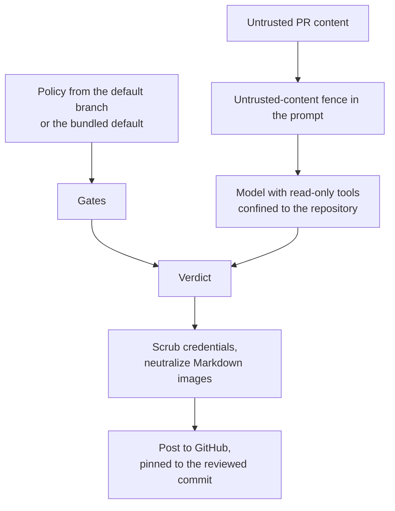

- stamp reads policy from the default branch or the bundled default, never from the checkout.
- The reviewer's tools are read-only and confined to the repository, symlinks included.
- Hooks, MCP config, `CLAUDE.md`, `AGENTS.md` and `.codex/` in the checkout are content, not configuration, on every backend.
- stamp scrubs posted bodies and neutralizes Markdown images.
- A supersession protocol governs approvals: no approval survives a re-review, a push, a retarget or a newer run's verdict.
- stamp auto-approves only people who could merge anyway.

[AGENTS.md](AGENTS.md) holds the details and invariants.

## Credits

`.agents/skills/pr/` is copied unchanged from [mattpocock/skills](https://github.com/mattpocock/skills) by Matt Pocock, under the MIT License, so it can be refreshed as he improves it. [THIRD_PARTY_NOTICES.md](THIRD_PARTY_NOTICES.md) records the commit and the notice. Its `CREDITS.md` credits Dex Horthy's `show-me` for the Summary section.

## Where to read more

- [AGENTS.md](AGENTS.md): the invariants that keep approvals and the reviewer sound.
- [`.stamp/review-guidance.md`](.stamp/review-guidance.md): the norms the reviewer works under.
- [`.stamp/policy.yml`](.stamp/policy.yml): the bundled policy, with the reasoning next to each rule.
- [`templates/stamp.yml`](templates/stamp.yml): the workflow `init` installs.
